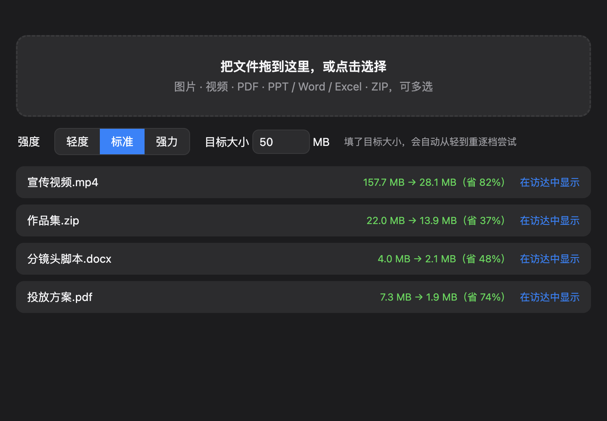

<div align="center">


# 压缩工具

**拖进去就压小。图片、视频、PDF、PPT / Word / Excel、ZIP，一个工具搞定。**

告诉它「要小于 50 MB」，它自己找到刚好够用的那一档。

[](https://github.com/Youkou970701/compress-tool/releases/latest)




</div>

## 为什么做这个

投标、投简历、发邮件、传平台，经常卡在一句「附件不能超过 50 MB」。
在线压缩站要上传文件、有大小限制、还得一种格式换一个网站；
这个工具把常见的几类文件放在一个窗口里，**全程在本机完成，文件不会离开你的电脑**。

## 下载

到 [Releases 页面](https://github.com/Youkou970701/compress-tool/releases/latest) 下载：

| 系统 | 文件 |
| --- | --- |
| macOS（Apple 芯片 M1 及以后） | `CompressTool-*-mac-arm64.dmg` |
| Windows 64 位 | `CompressTool-*-win-x64.exe`（安装版）或 `.zip`（免安装） |

装好就能用，不需要另外安装任何依赖（ffmpeg、Ghostscript 都已内置）。

<details>
<summary>第一次打开提示「无法验证开发者」/「已损坏」？</summary>

应用没有购买开发者签名，系统会拦一下，属于正常现象。

- **macOS**：右键点应用 → 打开 → 再点「打开」。仍提示已损坏时，在终端运行：
  `xattr -dr com.apple.quarantine /Applications/压缩工具.app`
- **Windows**：SmartScreen 弹窗里点「更多信息」→「仍要运行」。

</details>

## 怎么用

1. 把文件拖进窗口（可以一次拖很多个），或点击选择。
2. 选强度：**轻度 / 标准 / 强力**。
3. 想卡死大小就填**目标大小**，比如 `50`。它会从轻到重逐档尝试，到达标为止。
4. 结果保存在原文件旁边，叫 `原名-压缩.扩展名`，**不会覆盖原文件**。压不小的文件不会生成新文件，并告诉你原因。

## 每种文件是怎么压的

| 类型 | 做法 |
| --- | --- |
| 图片 `jpg` `png` `webp` `heic` | 重新编码，必要时缩小分辨率；`heic` 输出为 `jpg` |
| 视频 `mp4` `mov` `mkv` `avi` `webm` | H.264 重新编码。设了目标大小时，按视频时长**反推码率**，分辨率随码率自动下调 |
| PDF | Ghostscript 重新生成，降低内嵌图片的分辨率 |
| PPT / Word / Excel / ZIP | 解开压缩包，**重压里面的图片和视频**，再原样打包回去，文档内容和排版不变 |

### 实测

| 文件 | 压缩前 | 压缩后 | 备注 |
| --- | --- | --- | --- |
| 宣传视频 `.mp4` | 157.7 MB | 28.1 MB | 目标大小 30 MB |
| 作品集 `.zip` | 22.0 MB | 13.9 MB | 标准档，包内视频也被压缩 |
| 分镜头脚本 `.docx` | 4.0 MB | 2.1 MB | 标准档 |
| 投放方案 `.pdf` | 7.3 MB | 1.9 MB | 强力档（标准档只能压到 6.5 MB） |

> 压缩比取决于文件本身。已经压得很紧的文件、以文字为主的 PDF，能省的空间有限，这是正常的。

## 注意

- 压缩是**有损**的（图片、视频画质会下降），重要原件请自行保留；工具不会改动原文件。
- 目标大小设得太小时，视频会明显变糊；工具达不到目标时会明确提示，不会假装成功。
- 视频压缩比较吃 CPU，大文件会花几十秒到几分钟。

## 从源码运行

```bash
git clone https://github.com/Youkou970701/compress-tool.git
cd compress-tool
npm install
npm start
```

PDF 压缩依赖 Ghostscript：macOS 上 `brew install ghostscript` 后开发模式即可使用（发布包已内置）。

命令行直接测压缩核心：

```bash
node scripts/test.mjs <文件> [light|medium|strong] [目标MB]
```

## 技术栈

Electron · [sharp](https://sharp.pixelplumbing.com/)（图片）· [ffmpeg](https://ffmpeg.org/)（视频）· [Ghostscript](https://ghostscript.com/)（PDF）· [JSZip](https://stuk.github.io/jszip/)（Office / ZIP）

发版由 GitHub Actions 完成：推一个 `v*` 标签，自动在 macOS 和 Windows 上打包并发布到 Releases。

## 许可

本项目整合了 Ghostscript（AGPL）与 ffmpeg（GPL/LGPL）等第三方组件，请遵循各自的开源协议。
